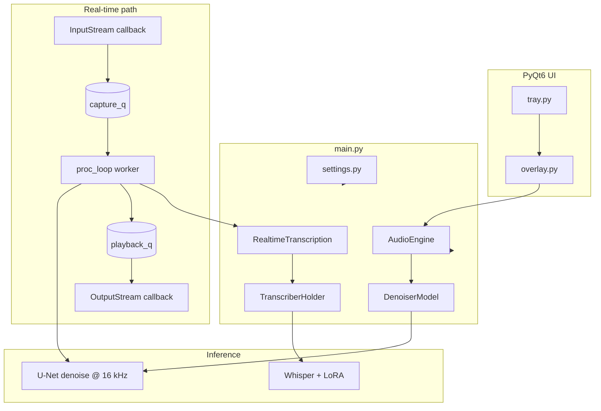
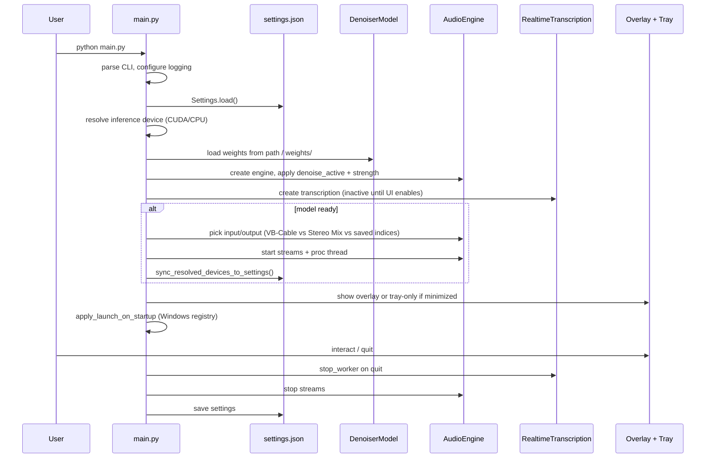
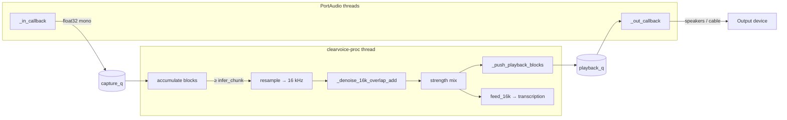
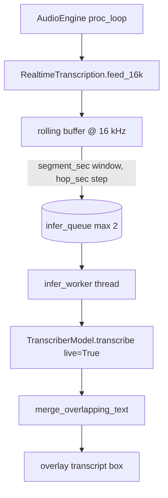

# ClearVoice

**ClearVoice** is a Windows desktop application for **real-time speech denoising** and **local speech-to-text**. It captures audio from a microphone or virtual cable, runs a PyTorch spectrogram U-Net denoiser in small chunks, plays the cleaned signal to your chosen output, and optionally shows **live captions** using Whisper large-v3-turbo with a LoRA adapter. The app runs from the **system tray** with an optional **floating control overlay** (PyQt6).

This document explains what the project does, how the pieces fit together, the end-to-end audio and transcription pipelines, configuration, and common setup workflows.

---

## Brief summary: trained weights → real-time denoise and captions

We trained two models separately, then plugged their saved weights into this app so everything runs on your PC in real time—no cloud API.

**Denoising** uses a custom U-Net trained on noisy speech. Its checkpoint (for example `weights/denoiser_epoch_15.pt`) is loaded into `DenoiserModel`. As audio comes in from the mic or virtual cable, the app cuts it into short pieces, resamples to 16 kHz, runs the network (STFT → predict a clean mask → ISTFT), and plays the cleaner sound to your speakers or VB-Cable. You can turn denoise on/off and blend how strong it is.

**Transcription** uses OpenAI’s **Whisper large-v3-turbo** as the base model, plus a **LoRA adapter** you fine-tuned (files in `whisper-lora-weights/`). On first use, the app downloads the base Whisper weights from Hugging Face, merges your LoRA on top, and keeps the model in memory. The same live audio stream (usually the raw mic, or optionally the denoised signal) is buffered into a few seconds at a time; each chunk is sent to Whisper, and new words are appended to the on-screen transcript without repeating overlap.

In practice: **one weight file powers live noise removal**, **another folder powers live speech-to-text**, both driven by the same audio pipeline in `audio_engine.py`.

---

## Table of contents

1. [Brief summary: trained weights → real-time denoise and captions](#brief-summary-trained-weights--real-time-denoise-and-captions)
2. [What you get](#what-you-get)
3. [High-level architecture](#high-level-architecture)
4. [Application startup workflow](#application-startup-workflow)
5. [Real-time audio pipeline](#real-time-audio-pipeline)
6. [Denoiser model pipeline](#denoiser-model-pipeline)
7. [Transcription pipeline](#transcription-pipeline)
8. [Offline file workflows](#offline-file-workflows)
9. [Threading and queues](#threading-and-queues)
10. [Project layout](#project-layout)
11. [Requirements and installation](#requirements-and-installation)
12. [Model weights](#model-weights)
13. [Audio setup and routing](#audio-setup-and-routing)
14. [Settings reference](#settings-reference)
15. [Command-line interface](#command-line-interface)
16. [User interface](#user-interface)
17. [Diagnostics and troubleshooting](#diagnostics-and-troubleshooting)
18. [License](#license)

---

## What you get

| Capability | Description |
|------------|-------------|
| **Live denoise** | Continuous capture → U-Net mask on STFT magnitude → playback with adjustable strength (0–100%). |
| **Virtual mic routing** | Send denoised audio to VB-Audio Virtual Cable so Discord, Zoom, OBS, etc. use it as a microphone. |
| **Live transcription** | Sliding-window Whisper + LoRA on the same audio path; overlapping segments merged to avoid repeated words. |
| **Offline denoise + play** | Load MP3/WAV/etc., denoise at 16 kHz, play through the selected output device. |
| **Offline transcribe** | Decode file → optional denoise-first → transcribe in 30 s chunks; export or copy text. |
| **Persistence** | Device indices, toggles, window position, and paths saved in `settings.json`. |

---

## High-level architecture

ClearVoice is a **multi-threaded PyQt6 app** with three cooperating subsystems:

1. **Audio I/O** (`audio_engine.py`) — PortAudio via `sounddevice`: separate input/output streams, capture callback, processing worker, playback callback.
2. **Denoiser** (`model.py`) — STFT → 3-level U-Net magnitude mask → ISTFT at **16 kHz mono**.
3. **Transcriber** (`transcriber_model.py`, `transcription.py`) — Hugging Face **Whisper large-v3-turbo** + **PEFT LoRA**, lazy-loaded on first use.



**Data flow (one sentence):** microphone blocks enter a queue, a background thread batches them, optionally denoises, pushes playback blocks, and optionally feeds 16 kHz audio into the transcription buffer; the output callback plays processed audio with preroll and crossfading.

---

## Application startup workflow

When you run `python main.py`, execution follows this order:



### Startup decisions (audio routing)

On first successful model load, `main.py` chooses devices automatically:

| Condition | Input | Output |
|-----------|--------|--------|
| **VB-Cable installed** | `CABLE Output` (captures everything sent to `CABLE Input`) | Saved hardware output, or auto-detected speakers/headphones (never back into the cable) |
| **No VB-Cable** | `Stereo Mix` / loopback if available, else `settings.input_device_index` | `settings.output_device_index` |

This lets the app **intercept system audio** when VB-Cable is the Windows default playback device, while still letting you hear denoised audio on real speakers.

---

## Real-time audio pipeline

The engine uses **split streams** (not a single duplex stream): one `InputStream` and one `OutputStream`. That avoids many Windows duplex host-API conflicts, though input and output should still prefer the **same driver family** (e.g. both WASAPI) when you care which physical device is used.

### Timing constants

| Constant | Value | Role |
|----------|-------|------|
| `IO_BLOCK_MS` | 20 ms | PortAudio callback block size (~20 ms latency per I/O step). |
| `INFER_CHUNK_MS` | 160 ms | How much audio the worker denoises per inference batch. |
| `_PLAYBACK_PREROLL_BLOCKS` | ~20 blocks (~400 ms) | Output stays silent until the playback queue is filled (avoids initial underruns). |
| `CHUNK_CONTEXT_SAMPLES_16K` | ≥2048 samples | Past audio prepended before STFT so chunk edges do not click. |

### Pipeline diagram



### Per-block processing steps

1. **Input callback** (`_in_callback`): copy mono channel, update input level meter and waveform ring buffer, enqueue to `capture_q` (drop oldest if full).
2. **Worker** (`_proc_loop`):
   - Concatenate capture blocks until `infer_chunk` samples exist (at stream sample rate).
   - If the capture queue is too deep, **trim old blocks** so denoise tracks recent speech, not seconds-old audio.
   - If denoise is on and the model is ready: resample to 16 kHz → overlap-add denoise → resample back → `out = original * (1 - strength) + enhanced * strength`.
   - If denoise is off or model failed: passthrough (`out = original`).
   - Clip to [-1, 1], slice into 20 ms blocks into `playback_q`.
   - If transcription is active: pick source (see below), resample to 16 kHz, `feed_16k`.
3. **Output callback** (`_out_callback`):
   - **Preroll**: output silence until `playback_q` has enough blocks.
   - **Play**: dequeue block; on underrun, output silence.
   - **Crossfade**: raised-cosine blend between consecutive blocks to reduce clicks when toggling denoise or at segment boundaries.

### Bypass and flush

Turning **denoise off** calls `_flush_denoise_pipeline()`: drains queues and clears STFT context so stale denoised audio cannot play after bypass.

### Device compatibility (Windows)

- PortAudio error **-9993** (“illegal combination of I/O devices”) happens when input and output use **different host APIs** (WDM-KS vs WASAPI vs DirectSound).
- The engine **remaps** device indices to the same host API when possible (name match, then driver label in parentheses).
- **Stereo Mix** must not be remapped to WASAPI (WASAPI treats it as a special loopback endpoint).
- Device names in the UI include a short API tag, e.g. `[WASAPI]`.

---

## Denoiser model pipeline

Implementation: `model.py` — class `DenoiserModel` wrapping `_SpectrogramDenoiser`.

### Signal processing chain

```text
mono float32 @ 16 kHz
    → STFT (N_FFT=512, HOP=128, WIN=512, Hann window)
    → magnitude (B,1,F,T) + phase
    → U-Net → sigmoid mask in [0,1]
    → masked magnitude × original phase
    → ISTFT → denoised waveform (same length as input)
```

### U-Net architecture

| Stage | Channels |
|-------|----------|
| enc1 | 1 → 32 |
| enc2 | 32 → 64 (max pool) |
| enc3 | 64 → 128 (max pool) |
| bottleneck | 128 → 256 (max pool) |
| dec3, dec2, dec1 | skip connections + transposed conv upsampling |
| output | 1×1 conv → mask |

Weights are loaded from `.pt` / `.pth` with support for checkpoints nested under keys `model`, `state_dict`, or `net`, and `module.` prefix stripping.

### Chunked real-time denoise

For streaming, `_denoise_16k_overlap_add` prepends `CHUNK_CONTEXT_SAMPLES_16K` from the previous chunk, runs the full network on the longer buffer, then returns only the samples aligned with the **current** chunk and updates the context tail. This mimics overlap-add continuity at STFT boundaries.

### Minimum length

Segments shorter than `MIN_SAMPLES` (1408 samples at 16 kHz) are zero-padded before STFT so three max-pool layers do not collapse the time axis.

---

## Transcription pipeline

### Models

| Component | Value |
|-----------|--------|
| Base model | `openai/whisper-large-v3-turbo` (downloaded via Hugging Face on first use, ~1.5 GB) |
| Adapter | PEFT LoRA in `whisper-lora-weights/` (`adapter_config.json` + `adapter_model.safetensors` or `.bin`) |
| Lazy load | `TranscriberHolder` loads once, thread-safe, on first transcription |
| Default ASR device | **CPU** when denoiser uses **CUDA** (`resolve_transcription_device`) to reduce GPU contention; override with `transcription_inference_device` |

### Live transcription workflow



1. **`feed_16k`**: append audio; whenever buffer ≥ `segment_sec` (default 2 s in code defaults, configurable in settings), copy one segment, advance buffer by `hop_sec` (default 1 s).
2. **`infer_worker`**: skip segments below `SILENCE_RMS` (0.0008); call `transcribe(..., live=True)` with `max_new_tokens=48`.
3. **`merge_overlapping_text`**: compare word suffix/prefix overlap with full transcript; emit only **new** words.
4. Callbacks: `on_new_text`, `on_status` update the overlay.

### Audio source for ASR

Controlled by `transcribe_denoised_audio` in settings. Even when enabled, `_pick_transcription_source` **falls back to the dry capture** if denoised audio is much quieter than input (Whisper needs sufficient level).

### Offline file transcription

`TranscribeFileThread` (Qt background thread):

1. `load_audio_mono` — soundfile → ffmpeg (bundled or PATH) → torchaudio fallback.
2. Resample to 16 kHz.
3. Optional **denoise-first** in 32k-sample chunks with strength mix.
4. Transcribe in **30 s** chunks (`OFFLINE_CHUNK_SEC`), `live=False`, `max_new_tokens=128`.
5. Emit progress, per-segment text, and final joined string.

---

## Offline file workflows

### Denoise file + play (`DenoiseFileThread`)

```text
file → decode → resample 16 kHz → denoise in 32k chunks → resample to output device rate → OutputStream playback
```

Uses the same `DenoiserModel.denoise` as live mode. Max length: **45 minutes** at 16 kHz (`_MAX_SAMPLES_16K`).

### File decode order (`load_audio_mono`)

1. **soundfile** — WAV, FLAC, OGG  
2. **ffmpeg** — system binary or `imageio-ffmpeg` bundled exe (MP3, M4A, …)  
3. **torchaudio** — last resort (often fragile on Windows without TorchCodec)

---

## Threading and queues

| Thread | Name | Responsibility |
|--------|------|----------------|
| Main / Qt GUI | — | Overlay, tray, timers, file job signals |
| PortAudio input | callback | Enqueue capture only (must stay fast) |
| PortAudio output | callback | Dequeue playback, crossfade, meters |
| `clearvoice-proc` | daemon | Denoise batching, transcription feed |
| `RealtimeTranscription` infer | daemon | Whisper on segment queue |
| `LoadTranscriberThread` | QThread | First-time Whisper download/load off GUI |
| `DenoiseFileThread` / `TranscribeFileThread` | QThread | Offline jobs |

| Queue | Max size | Purpose |
|-------|----------|---------|
| `capture_q` | 64 | Mic blocks waiting for worker |
| `playback_q` | 64 | Processed blocks waiting for output callback |
| `_infer_queue` (transcription) | 2 | Drop older segments if Whisper falls behind |

---

## Project layout

| File / folder | Role |
|---------------|------|
| `main.py` | Entry point: argparse, settings, model/engine/transcription wiring, VB-Cable vs loopback startup, Qt app lifecycle. |
| `model.py` | `SpectrogramDenoiser` / `DenoiserModel`, STFT constants, `resolve_inference_device`. |
| `audio_engine.py` | `AudioEngine`: streams, worker loop, device discovery/remap, VB-Cable helpers, meters. |
| `audio_util.py` | `segment_rms`, `SILENCE_RMS` (shared, no engine import). |
| `audio_diag.py` | Rotating log `logs/clearvoice_audio_debug.log` for stutter debugging. |
| `overlay.py` | Frameless overlay: devices, denoise power, strength, waveforms, transcription UI, file jobs. |
| `tray.py` | System tray icon (green/gray), menu: show, toggle denoise/transcription, exit. |
| `settings.py` | JSON load/save, defaults, `resolve_transcription_device`. |
| `transcriber_model.py` | `TranscriberModel`, `TranscriberHolder`, `LoadTranscriberThread`, adapter validation. |
| `transcription.py` | `RealtimeTranscription`, `TranscribeFileThread`, overlap merge. |
| `file_playback.py` | `load_audio_mono`, `DenoiseFileThread`. |
| `settings.json` | User persistence (created/updated at runtime). |
| `weights/` | Denoiser checkpoint(s), e.g. `denoiser_epoch_15.pt`. |
| `whisper-lora-weights/` | LoRA adapter for Whisper. |
| `logs/` | Audio diagnostics log. |
| `clearscribe/` | Older reference app (mic-only transcription); **superseded** by root `main.py`. |
| `requirements.txt` | Python dependencies. |

---

## Requirements and installation

### Platform

- **Windows** (startup registry, audio device behavior, and docs target Windows).
- **Python 3.10+** (modern typing syntax).

### Install dependencies

From the project directory:

```bash
python -m venv .venv
.venv\Scripts\activate
pip install -r requirements.txt
```

**Core packages:** `torch`, `torchaudio`, `sounddevice`, `numpy`, `PyQt6`, `psutil`, `scipy`, `transformers`, `peft`, `imageio-ffmpeg`, `soundfile`.

### GPU (recommended for denoiser)

Default pip `torch` on Windows is often **CPU-only**. For NVIDIA GPUs:

```bash
pip uninstall -y torch torchaudio
pip install torch torchaudio --index-url https://download.pytorch.org/whl/cu126
```

Pick the CUDA build that matches your driver from [pytorch.org](https://pytorch.org/get-started/locally/).

On startup, if GPU is available but `settings.json` still says `"inference_device": "cpu"`, the app may **auto-migrate** to CUDA once.

---

## Model weights

### Denoiser (U-Net)

| Location | Notes |
|----------|--------|
| `weights/denoiser_epoch_15.pt` | Default expected path |
| Any `.pt` / `.pth` under `weights/` | Auto-picked if default missing |
| CLI `--weights PATH` | Overrides settings |
| First-run file dialog | If nothing found, user picks a file; path saved to `settings.json` |

The network always processes **16 kHz mono** internally; the engine resamples device I/O as needed.

### Whisper LoRA (transcription)

Place under `whisper-lora-weights/`:

- `adapter_config.json`
- `adapter_model.safetensors` (or `adapter_model.bin` / `.pt`)

Override with `--whisper-weights PATH` or `whisper_weights_path` in settings.

**Air-gapped machines:** pre-download `openai/whisper-large-v3-turbo` into the Hugging Face cache (`HF_HOME` or default `~/.cache/huggingface`).

---

## Audio setup and routing

### Recommended: VB-Audio Virtual Cable

Best for using denoised audio as a **microphone** in other apps:

1. Install [VB-Audio Virtual Cable](https://vb-audio.com/Cable/).
2. Set Windows **playback default** to **CABLE Input** (optional, for full system intercept).
3. In ClearVoice: output can go to **real speakers**; input auto-selects **CABLE Output** when detected.
4. In Discord/Zoom/OBS: microphone = **CABLE Input**.

If VB-Cable is missing, a one-time hint appears (dismiss permanently via checkbox → `hide_vbcable_warning`).

### Microphone only (no system audio)

Choose your **physical microphone** as **Input device** in the overlay, pick **Output** (headphones/speakers or VB-Cable), click **Apply & Restart**.

ClearVoice only processes the **selected input**; it does not automatically capture “what the PC is playing” unless that signal appears on the chosen input.

### System audio (YouTube, games) without VB-Cable

| Method | Behavior |
|--------|----------|
| **Stereo Mix** / “What U Hear” | Copy-capture; original still plays through speakers. Enable in Windows Sound → Recording → Show disabled devices. |
| **Voicemeeter** (or similar) | Route app output to a virtual bus exposed as a recording device; select that input in ClearVoice. |

Avoid routing ClearVoice **output** back into the same loopback input (feedback). Use headphones or a separate virtual output while testing.

### Latency expectations

End-to-end latency is roughly: I/O blocks + preroll (~400 ms) + inference chunk (160 ms) + queue depth. GPU denoise typically adds tens of milliseconds per chunk; CPU is slower. Tune by reducing preroll only in code (not exposed in UI).

---

## Settings reference

File: **`settings.json`** next to the app (safe to edit when ClearVoice is closed).

| Key | Type | Default | Description |
|-----|------|---------|-------------|
| `weights_path` | string | `weights/denoiser_epoch_15.pt` | Denoiser checkpoint path. |
| `denoise_active` | bool | `true` | Master denoise on/off (tray/overlay power). |
| `input_device_index` | int \| null | `null` | PortAudio input device index. |
| `output_device_index` | int \| null | `null` | PortAudio output device index. |
| `strength` | float | `1.0` | Denoise mix 0.0 = dry, 1.0 = full wet. |
| `inference_device` | `"cpu"` \| `"cuda"` | auto-detect | Denoiser GPU/CPU. |
| `window_x`, `window_y` | int \| null | `null` | Overlay position. |
| `start_minimized` | bool | `false` | Start in tray only. |
| `launch_on_startup` | bool | `false` | Windows Run registry entry. |
| `hide_vbcable_warning` | bool | `false` | Suppress VB-Cable install hint. |
| `whisper_weights_path` | string | `whisper-lora-weights` | LoRA adapter directory. |
| `transcribe_active` | bool | `false` | Restore live transcription on launch. |
| `transcription_language` | string \| null | `null` | Force language code (`en`, `ar`, …); `null` = auto. |
| `transcription_segment_sec` | float | `2.0` | Live ASR window length (seconds). |
| `transcription_hop_sec` | float | `1.0` | Advance between live segments (seconds). |
| `transcribe_denoised_audio` | bool | `false` | Prefer denoised signal for live ASR (with level fallback). |
| `file_transcribe_denoise_first` | bool | `false` | Offline transcribe: denoise before Whisper. |
| `transcription_inference_device` | `"auto"` \| `"cpu"` \| `"cuda"` | `"auto"` | Whisper device; `auto` uses CPU when denoiser uses CUDA. |

Example:

```json
{
  "weights_path": "D:\\WORKSHOP\\ALL\\ann-project\\weights\\denoiser_epoch_15.pt",
  "denoise_active": true,
  "input_device_index": 1,
  "output_device_index": 7,
  "strength": 1.0,
  "inference_device": "cuda",
  "transcribe_active": true,
  "transcription_segment_sec": 8.0,
  "transcription_hop_sec": 1.0,
  "transcribe_denoised_audio": true,
  "file_transcribe_denoise_first": true,
  "transcription_inference_device": "cuda"
}
```

---

## Command-line interface

```bash
python main.py [options]
```

| Option | Description |
|--------|-------------|
| `--weights PATH` | Denoiser `.pt` / `.pth` file. |
| `--device cpu` \| `cuda` | Inference device for denoiser (saved to settings). |
| `--minimized` | Start hidden to tray. |
| `--no-audio-debug-log` | Disable `logs/clearvoice_audio_debug.log`. |
| `--whisper-weights PATH` | LoRA adapter folder. |
| `--language CODE` | Force transcription language (e.g. `en`, `ar`). |

---

## User interface

### System tray (`tray.py`)

- **Icon**: green when denoise active, gray when off (refreshed every 400 ms).
- **Double-click**: show/hide overlay.
- **Menu**: Show, Toggle denoising, Toggle transcription, Exit.

### Overlay (`overlay.py`)

Frameless dark-themed window with:

- **Power** — denoise on/off (flushes pipeline when off).
- **Input / Output** — device combos with host API tags; **Apply & Restart** restarts streams.
- **Strength** slider — wet/dry mix.
- **Inference** — CPU/CUDA for denoiser (reload/move model).
- **Waveforms** — ~1 s input/output traces.
- **Levels** — peak meters (dB).
- **Transcription** — toggle, segment/hop spinners, denoised-audio checkbox, transcript view (clear/copy/save).
- **File** — open audio, denoise & play, transcribe file (optional denoise-first).
- **Weights** — browse denoiser checkpoint.
- **Startup** — launch with Windows, start minimized.

Closing the overlay window **minimizes to tray** (does not quit). Use tray **Exit** to stop the app.

---

## Diagnostics and troubleshooting

### Log files

| Log | Content |
|-----|---------|
| Console / default logging | INFO level: startup, device remap, model load. |
| `logs/clearvoice_audio_debug.log` | Queue depths, infer ms, callback paths (`preroll`, `play`, `underrun`), PortAudio status flags. |

Look for: `capture_trim`, `capture_q_drop`, `underrun`, `infer_exception`, `output_underflow`.

Disable file diag with `--no-audio-debug-log`.

### Common issues

| Symptom | Likely cause | What to do |
|---------|----------------|------------|
| **Illegal combination of I/O devices (-9993)** | Input/output on different host APIs | Pick two devices with the same `[WASAPI]` (or same) tag; let auto-remap run. |
| **No audio / silence** | Wrong device, preroll, or model not loaded | Check overlay status; verify weights path; wait ~400 ms after start. |
| **CUDA requested but CPU used** | CPU-only PyTorch wheel | Reinstall CUDA-enabled `torch` (see installation). |
| **Whisper not ready** | Missing adapter files or HF download blocked | Validate `whisper-lora-weights/`; ensure network for first base model download. |
| **Live captions lag** | Segment length too large or GPU busy | Lower `transcription_segment_sec`; set `transcription_inference_device` to `cuda` if VRAM allows both models. |
| **Transcription empty** | Segment too quiet | Speak louder; check `SILENCE_RMS` skips in debug log. |
| **File won’t open** | No decoder | `pip install imageio-ffmpeg`; or convert to WAV. |
| **Echo / feedback** | Output routed into same input as capture | Use headphones or separate virtual devices. |

### Stopping cleanly

On quit, `main.py` stops the transcription worker, stops audio streams, and saves `settings.json`.

---

## License

Add a license file here if you distribute the project.
