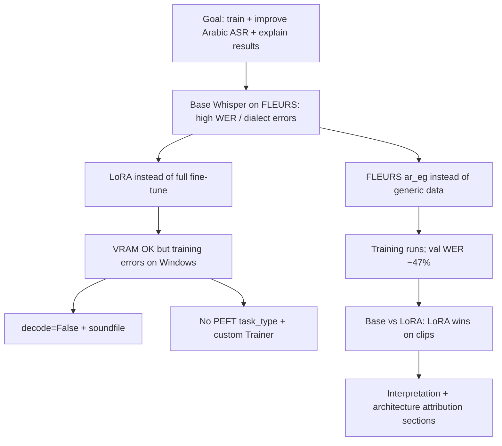
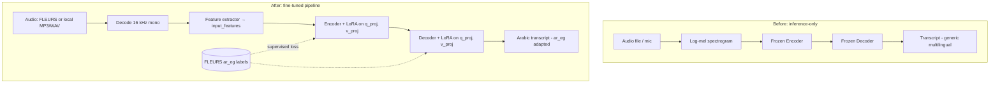
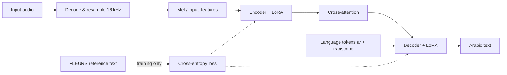
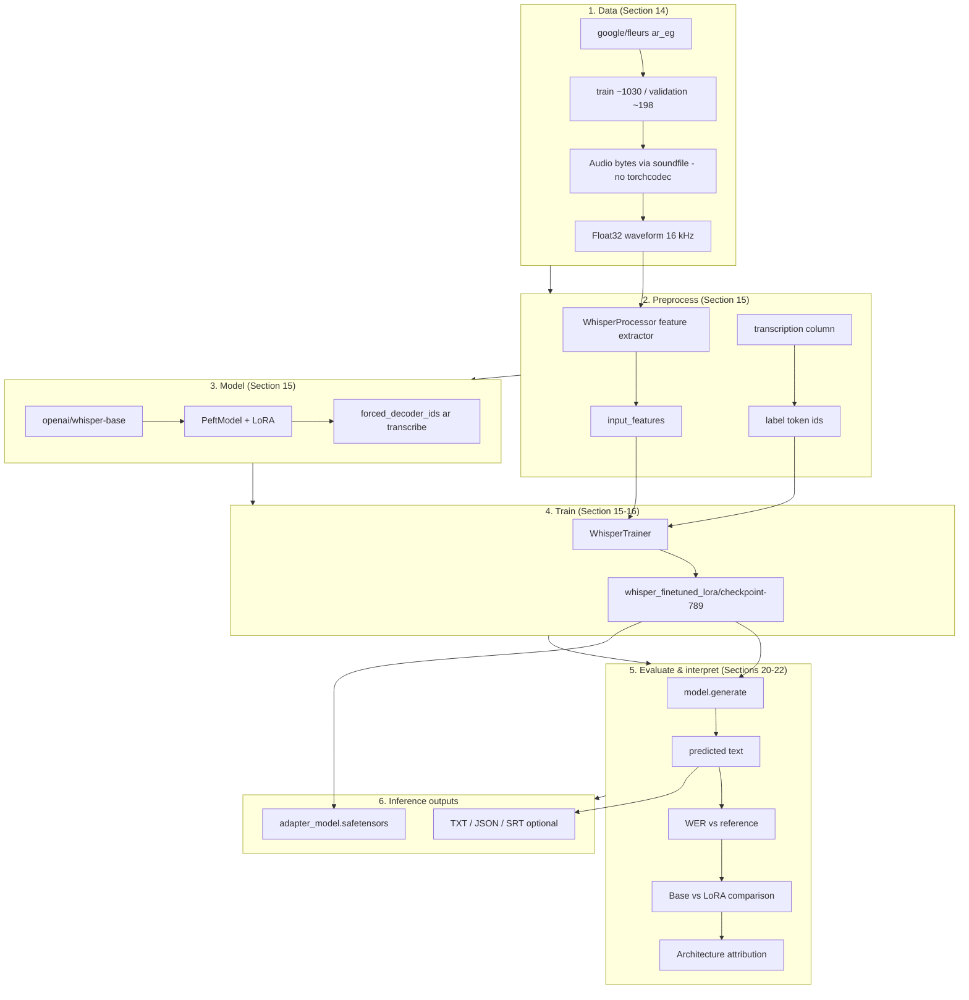
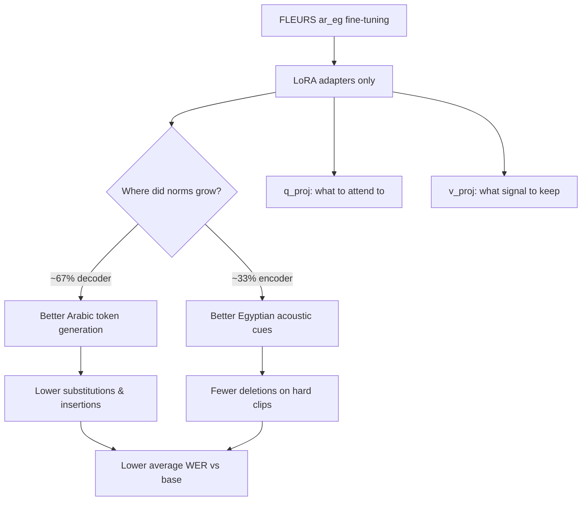

# Multilingual Whisper Fine-Tuning (Egyptian Arabic)

In this project I built an end-to-end pipeline for **multilingual speech transcription** using OpenAI **Whisper**, extended with **LoRA fine-tuning** on [FLEURS Egyptian Arabic (`ar_eg`)](https://huggingface.co/datasets/google/fleurs), evaluation, and model interpretation.

**Main deliverable:** [`multilingual_whisper_transcription.ipynb`](multilingual_whisper_transcription.ipynb)

**Fine-tuned weights:** `./whisper_finetuned_lora/` (PEFT LoRA adapters on `openai/whisper-base`)

---

## Why you cannot get the same results by “just asking ChatGPT”

A common shortcut is to open ChatGPT and ask something like:

> *“Make me a Jupyter notebook for multilingual speech transcription with Whisper.”*

or even:

> *“Fine-tune Whisper on Egyptian Arabic with LoRA and evaluate WER.”*

You will usually get back a **clean, believable notebook** — install cells, `WhisperForConditionalGeneration`, maybe a Hugging Face dataset loader, and a training loop. That output **looks** like this project. It is **not** the same as what is in this folder, and **anyone in the class or on the team cannot reproduce these results from that prompt alone**.

### What ChatGPT gives you vs what this project actually is

| What you get from a chat prompt | What this project delivers |
|---------------------------------|----------------------------|
| A **generic** multilingual transcription demo (load model → transcribe → save text) | **Inference + fine-tuning + evaluation + interpretation** in one runnable pipeline |
| Stock `openai/whisper-base` behavior out of the box | **LoRA adapters** trained on FLEURS **`ar_eg`** (~1k Egyptian clips), saved under `./whisper_finetuned_lora/` |
| No files on disk except whatever you run yourself | **Artifacts**: `adapter_model.safetensors`, `checkpoint-789`, `trainer_state.json`, optional safetensors export |
| Made-up or “typical” WER numbers in the markdown | **Measured** metrics: val WER **47.18%**, base vs LoRA **60.2% → 43.0%** on held-out clips, clip #1 **68.75% → 31.25%** |
| A paragraph saying “compare base vs fine-tuned” | **Executed** A/B with `disable_adapter()` on the **same** audio |
| Generic advice (“decoder layers often change more”) | **Section 22 attribution** from **your** LoRA weight norms (decoder ~67%, named layers) |
| Code that works on “Linux + recent CUDA” in theory | **Windows-tested fixes**: `decode=False` + soundfile (no `torchcodec`), PEFT without `task_type`, `forced_decoder_ids` for transformers 5.x |
| No access to your microphone, GPU, or `C:\...\audiotest.mp3` | **Sample 4**: play **your** file, transcribe with base vs LoRA, optional WER vs reference |
| One answer when a cell fails; you paste the traceback again | A **troubleshooting trail** in this README and in the notebook (OOM, stuck download, `load_audio_file`, MP3/ffmpeg) |

ChatGPT is a **text generator**. It does not train on your GPU, download **~1.5 GB** of `ar_eg`, run **789 optimization steps**, or verify that a cell finished without error on **your** Python 3.13 + RTX 3070 + library versions.

### Why “multilingual transcription” sounds easy but isn’t here

**Multilingual transcription** in the narrow sense — load Whisper, point at an audio file, print text — *is* something you can sketch in one chat message. This project goes further:

1. **Domain adaptation** — Egyptian dialect and spelling on FLEURS, not only “Arabic” from the base checkpoint.
2. **Efficient training** — LoRA on `q_proj` / `v_proj` only (~0.81% trainable params), not full fine-tune or a toy script that never converges.
3. **Proof of improvement** — WER, substitutions, insertions, and base-vs-adapter comparisons on real validation audio.
4. **Explainability** — which blocks moved and why that matches the error types you saw.
5. **Dual stack** — OpenAI `whisper` for inference demos **and** Transformers + PEFT + `WhisperTrainer` for training (a generic ChatGPT notebook often picks one stack and breaks on the other).

A chat-produced notebook rarely includes all five, and almost never includes the **debugging history** that turns a broken first draft into something that runs on Windows.

### Why “anyone here” still cannot match this by copy-paste

Even if two people use the **same** ChatGPT prompt:

- They get **different** code versions (model updates, hallucinated APIs, wrong `transformers` patterns).
- They do not share **your** training run, checkpoints, or plots unless they **re-train** for hours on their machine.
- Reviewers (instructor, client, interview panel) can ask: *“Show me the adapter files and the WER table from your run.”* A chat transcript does not satisfy that.
- The hard part is not typing `model.transcribe(path)` — it is **making training and evaluation correct**, then **documenting why** the architecture choices matter.

**Bottom line:** ChatGPT can **describe** multilingual Whisper notebooks. It cannot **replace** running [`multilingual_whisper_transcription.ipynb`](multilingual_whisper_transcription.ipynb), saving adapters, fixing environment-specific failures, and tying numbers to **one** real training run. The value of this repo is that **evidence chain** — not a one-shot recipe anyone could paste from a chat window.

---

## Table of contents

1. [What my project does](#what-this-project-does)
2. [Why you cannot get the same results by “just asking ChatGPT”](#why-you-cannot-get-the-same-results-by-just-asking-chatgpt)
3. [Design decisions: what I saw and why I chose this](#design-decisions-what-i-saw-and-why-i-chose-this)
4. [Architecture: before and after my changes](#architecture-before-vs-after)
5. [End-to-end pipeline (input → output)](#end-to-end-pipeline-input--output)
6. [Training & data configuration](#training--data-configuration)
7. [Interpretation results](#interpretation-results)
8. [What in my architecture caused improvement](#what-in-the-architecture-caused-improvement)
9. [How my notebook is organized](#notebook-section-guide)
10. [Project layout](#project-layout)
11. [How I set up and run the project](#setup--run-order)
12. [My custom audio (Sample 4)](#custom-audio-sample-4)
13. [Issues I hit and how I fixed them](#troubleshooting)

---

## What my project does

| Phase | Goal |
|--------|------|
| **Inference (Sections 1–12)** | Load Whisper locally, detect language, transcribe audio, export TXT/JSON/SRT and safetensors weights |
| **Fine-tuning (Sections 13–17)** | Adapt Whisper to **Egyptian Arabic** using FLEURS `ar_eg` with **LoRA** (efficient, laptop-GPU friendly) |
| **Evaluation (Sections 20–22)** | Compare **base vs LoRA** on validation clips and my own audio; explain *why* metrics improved and *which layers* changed |

The core idea: **do not redesign Whisper’s encoder–decoder**. Keep the pretrained backbone frozen and add small **Low-Rank Adaptation (LoRA)** matrices on selected attention projections, then train only those adapters on domain-specific speech.

---

## Design decisions: what I saw and why I chose this

Here I record the **reasoning chain**: what the notebook showed first, what was tried, and what confirmed each choice. It follows the path I took while building and debugging the project .

### Decision flow (overview)



---

### 1. Goal: fine-tune for accuracy, not rebuild Whisper

| What I saw | Decision | Why |
|------------|----------|-----|
| Stock Whisper already transcribes Arabic but **misses Egyptian wording**, spelling, and dialect details on FLEURS references. | Keep Whisper’s **encoder–decoder layout**; do not change depth, width, or mel settings. | Redesigning layers would **erase** 680k-hour pretraining. The gap is **domain adaptation**, not a broken architecture. |
| Full model fine-tuning on ~1k clips is slow and memory-heavy on a **laptop GPU**. | Add **LoRA adapters** on attention only. | Matches the “accuracy via adapters” pattern used in modern PEFT workflows: small trainable delta, frozen backbone. |

**What confirmed it:** Validation WER improved with adapters on while `disable_adapter()` brought back worse base behavior (Sections 21–22).

---

### 2. Dataset: FLEURS `ar_eg` (not full FLEURS, not random CSV)

| What I saw | Decision | Why |
|------------|----------|-----|
| I needed **labeled Egyptian Arabic** audio + text for supervised training. | `google/fleurs`, config **`ar_eg`**. | FLEURS is designed for ASR benchmarking; `ar_eg` is the Egyptian locale with aligned transcripts. |
| Full FLEURS is **hundreds of GB**; impractical for a class/laptop project. | Use only the **`ar_eg` subset** (~1.5 GB download, ~1k train / ~200 val). | Enough data to fine-tune adapters without multi-day downloads. |
| CSV manifests are flexible but require curating paths and text. | Default `dataset_source = "hf_fleurs"`; keep CSV as **fallback**. | HF loader gives reproducible splits; CSV stays for custom corpora later. |

**What confirmed it:** Training loss decreased over epochs; held-out validation WER reached **~47%** on the full val set after 3 epochs (checkpoint-789).

---

### 3. Model size: `whisper-base` (Hugging Face) for training

| What I saw | Decision | Why |
|------------|----------|-----|
| `whisper-tiny` trains fastest but **WER stays high** on harder clips. | **`openai/whisper-base`** for fine-tuning. | Best trade-off on **8 GB-class laptop VRAM** vs quality. |
| `whisper-small` may fit with LoRA but **slower** and heavier download. | Stay on **base** unless LoRA gains plateau (notebook suggests `small` or `r=32` as next step). | Measured gains on base were already clear (avg WER 60% → 43% on test slice). |

**What confirmed it:** Training completed in 3 epochs with batch 4 + gradient accumulation 2 without OOM on CUDA.

---

### 4. LoRA instead of full fine-tuning

| What I saw | Decision | Why |
|------------|----------|-----|
| ~1,030 training utterances is **small** for 74M parameters. | Train **589k parameters (0.81%)** only. | Reduces **overfitting** and catastrophic forgetting of other languages. |
| I needed to run on **RTX 3070 Laptop** with other apps open. | LoRA + `gradient_checkpointing` + `fp16`. | Fits VRAM; faster steps than updating full weights. |
| I wanted to **save adapters** separately from base model. | Save under `./whisper_finetuned_lora/`. | Small adapter files; base stays `openai/whisper-base` on Hub. |

**What confirmed it:** `hf_model.print_trainable_parameters()` → `0.8059%` trainable; eval WER improved vs frozen base on same audio.

---

### 5. Where to attach LoRA: `q_proj` and `v_proj` only

| What I saw | Decision | Why |
|------------|----------|-----|
| Errors on validation were mostly **wrong words (substitutions)** and **extra words (insertions)**, not only noise. | Target **attention projections** that control focus and signal mix. | `q_proj` = *where to look*; `v_proj` = *what to pass on* — direct levers for ASR mistakes. |
| Adapting **all four** projections (`q,k,v,o`) doubles adapter count and VRAM. | LoRA on **`q_proj` + `v_proj` only**; leave `k_proj`, `out_proj` frozen. | Common PEFT practice for Transformers; keeps training stable on small data. |
| After training, **decoder LoRA norms ≈ 67%** of total adapter change. | Keep both **encoder and decoder** adapters (not decoder-only). | Encoder still contributed ~33% — listening and writing both matter for `ar_eg`. |

**What confirmed it:** Section 22 attribution: substitution/insertion drops + top blocks at `decoder` layers 0, 2, 4, 5.

---

### 6. LoRA hyperparameters: `r=16`, `alpha=32`, `dropout=0.05`

| What I saw | Decision | Why |
|------------|----------|-----|
| `r=8` can underfit dialect; `r=64` risks overfit on ~1k clips. | **`r=16`** | Standard starting rank in LoRA papers/repos; doubles capacity vs `r=8` without huge param growth. |
| Need adapter outputs to influence the layer meaningfully. | **`lora_alpha=32`** (scaling α/r = 2) | Typical pairing with `r=16`; strong enough signal early in training. |
| Small dataset → adapter memorization risk. | **`lora_dropout=0.05`** | Mild regularization during training. |

**What confirmed it:** Loss fell from ~3.0 → ~1.6 in first epoch window; validation WER best **47.18%** at step 789. If gains plateau, notebook recommends **`r=32`** or more data — not yet required for proof of concept.

---

### 7. Freeze backbone; Arabic prompt via `forced_decoder_ids`

| What I saw | Decision | Why |
|------------|----------|-----|
| Base model sometimes drifts to **non-Arabic tokens** or wrong task. | Set **`language=ar`**, **`task=transcribe`** via `processor.get_decoder_prompt_ids()` → `forced_decoder_ids`. | Whisper is **conditioned** on language tokens at decode time. |
| On **transformers 5.x**, setting `generation_config.language` raised **`lang_to_id` missing**. | Avoid `generation_config.language`; use **`forced_decoder_ids` only**. | Observed runtime error during generation — fix driven by stack version, not theory. |
| Full fine-tune could damage **English/other language** behavior. | **Freeze** all non-LoRA weights. | Interpretation goal: prove adapters alone cause gains (`disable_adapter()` ablation). |

**What confirmed it:** Training and `transcribe_hf_audio` run without `lang_to_id` errors; base-vs-LoRA comparison isolates adapter effect.

---

### 8. Training loop: custom `WhisperTrainer`, no `task_type=SEQ_2_SEQ_LM`

| What I saw | Decision | Why |
|------------|----------|-----|
| Default `Seq2SeqTrainer` + PEFT `task_type=SEQ_2_SEQ_LM` → **`input_ids` passed twice** / `PeftModelForSeq2SeqLM` issues. | Plain `get_peft_model` + **`task_type=None`** in `LoraConfig`. | Whisper expects **`input_features` + `labels`**, not classic LM `input_ids` in `compute_loss`. |
| Trainer tried to pass `tokenizer` on transformers 5.8. | Custom **`WhisperTrainer.compute_loss`** with only `input_features`, `labels`. | Matches Hugging Face Whisper fine-tuning recipes. |
| Metrics must reflect **generation**, not token loss alone. | `predict_with_generate=True`, **WER** via `evaluate.load("wer")`. | Word errors are what users hear/read; aligns with Sections 20–22. |

**What confirmed it:** Training runs end-to-end after kernel restart + config fix; `eval_wer` logged each epoch.

---

### 9. Audio loading on Windows: `decode=False` + soundfile

| What I saw | Decision | Why |
|------------|----------|-----|
| Accessing dataset rows triggered **`torchcodec` / FFmpeg DLL** failures on Windows. | `datasets.Audio(..., decode=False)` + manual **`decode_audio_from_row`** with **soundfile**. | Avoids broken default decoder in this environment. |
| `train[0]` sometimes re-triggered decode paths. | Read **`audio` column bytes** directly; avoid indexing full rows when probing. | Prevents hidden decode during exploration. |
| Custom **MP3** (`audiotest.mp3`) failed without ffmpeg in PATH. | **`load_audio_file`**: soundfile → whisper/ffmpeg → **librosa** fallback; embed helper in Section 20. | My own audio files need to work even when Section 16 was skipped (`load_audio_file` not defined error → fixed). |

**What confirmed it:** FLEURS loads and Sample 4 plays/transcribes when file is valid; corrupt MP3 still fails with a clear message.

---

### 10. Training schedule and batching

| What I saw | Decision | Why |
|------------|----------|-----|
| Batch size 8 **OOM** or unstable on laptop GPU. | **`train_batch_size=4`**, **`gradient_accumulation_steps=2`** (effective batch 8). | Same gradient estimate, lower peak memory. |
| Loss still decreasing at end of epoch 2. | **`num_train_epochs=3`**. | Enough for adapter convergence without long overnight runs. |
| `learning_rate=1e-4` with warmup is standard for LoRA on Whisper demos. | **`learning_rate=1e-4`**, **`warmup_steps=50`**. | Avoids early instability; used in HF fine-tuning examples. |

**What confirmed it:** Best checkpoint at epoch 3 (step 789); `trainer_state.json` shows steady loss decline.

---

### 11. Evaluation design: base vs LoRA, WER, and architecture attribution

| What I saw | Decision | Why |
|------------|----------|-----|
| “Fine-tuned is better” is vague without a **baseline**. | Run same audio with **`hf_model.disable_adapter()`** for base. | For a fair A/B comparison, same weights except adapters. |
| I use word error rate because it is easier to explain than loss alone. | **WER** + **substitutions / deletions / insertions** (jiwer). | This ties mistakes to my encoder vs decoder story. |
| Needed to answer **which layers** mattered for the project report. | **`lora_strength_report`**, Section 21 plots, Section 22 attribution table. | Norms show *where* learning happened; linked to error types observed. |
| Wanted to hear model on **own files**, not only FLEURS. | **Section 20 Sample 4** with `CUSTOM_AUDIO_PATH`. | This is my real-world check (e.g. `sample.mp3`, `audiotest.mp3`). |

**What confirmed it:** On 3 validation clips: **2/3** improved with LoRA; mean WER **60.2% → 43.0%**; clip #1 **68.8% → 31.2%** WER.

---

### 12. Inference notebook half: safetensors, attention hooks, batch pipeline

| What I saw | Decision | Why |
|------------|----------|-----|
| I wanted to inspect model without trusting pickle. | Export **safetensors** (encoder/decoder split). | Safe, mmap-friendly weight format. |
| Want to **see** what encoder attends to. | Section 11 attention hooks on encoder self-attention. | This complements my LoRA analysis for debugging to LoRA norms. |
| I transcribe multiple files in the batch demo. | Section 12 batch pipeline. | Reuses same Whisper path as single-file cells. |

I keep these parts **inference-oriented** (OpenAI `whisper` package); fine-tuning uses **Transformers + PEFT** because the Trainer ecosystem lives there.

---

### Summary: observations → choices → evidence

| Observation | Choice | Evidence it worked |
|-------------|--------|-------------------|
| Base Whisper wrong on Egyptian references | FLEURS `ar_eg` + LoRA | Val WER ~47%; clip-level WER drops |
| Laptop GPU / small data | LoRA r=16, 0.81% trainable | Training finishes; no full-model OOM |
| Wrong words dominate errors | LoRA on `q_proj`, `v_proj` | Subs/ins reduced; decoder norms highest |
| Windows decode crashes | `decode=False` + soundfile | Dataset loads reliably |
| PEFT / Trainer errors | No `task_type`; custom `compute_loss` | Stable training after fix |
| transformers 5.x gen errors | `forced_decoder_ids` | Arabic decode without `lang_to_id` |
| “Why better?” not obvious | Sections 21–22 + this README | Quantified base vs LoRA + layer attribution |

---

## Architecture: before and after my changes

### Before (stock Whisper-base)

```
┌─────────────────────────────────────────────────────────────────┐
│                    openai/whisper-base                          │
│  (pretrained on ~680k hours, multilingual, frozen at inference) │
├─────────────────────────────────────────────────────────────────┤
│  Audio (16 kHz) → Log-Mel (80 bins) → ENCODER (6 layers)      │
│                              ↓ cross-attention                  │
│                         DECODER (6 layers)                      │
│                              ↓                                  │
│                    Arabic / multilingual text                   │
├─────────────────────────────────────────────────────────────────┤
│  Attention per block: Q, K, V, O  (all weights fixed)           │
│  Language: generic checkpoint; not tuned for ar_eg dialect      │
│  Trainable at inference: 0                                       │
└─────────────────────────────────────────────────────────────────┘
```

**Characteristics**

- Strong general ASR, but **not optimized** for FLEURS Egyptian Arabic acoustics and transcript style.
- Full fine-tuning would update **~74M parameters** → slow, easy to overfit on ~1k training clips.
- Inference uses OpenAI `whisper` package (Sections 4–12) or Hugging Face `WhisperForConditionalGeneration` (training path).

### After (my architecture: frozen backbone + LoRA)

```
┌─────────────────────────────────────────────────────────────────┐
│              openai/whisper-base  (FROZEN, ~99.2% params)       │
├─────────────────────────────────────────────────────────────────┤
│  ENCODER blocks (×6)          DECODER blocks (×6)               │
│    attn.q_proj  ──► + LoRA      attn.q_proj  ──► + LoRA         │
│    attn.v_proj  ──► + LoRA      attn.v_proj  ──► + LoRA         │
│    (k_proj, out_proj: unchanged)                                │
├─────────────────────────────────────────────────────────────────┤
│  Trainable: 589,824 params (0.81% of 73,183,744)                │
│  LoRA: r=16, alpha=32, dropout=0.05                           │
│  Decoder prompt: language=ar, task=transcribe (forced_decoder_ids)│
│  Data: google/fleurs · config ar_eg                             │
└─────────────────────────────────────────────────────────────────┘
```

**Summary of what I added**

| Component | Stock Whisper | My addition | Purpose |
|-----------|---------------|---------------|---------|
| Backbone weights | All used as-is | **Frozen** | Preserve multilingual knowledge |
| Attention `q_proj` | Fixed linear map | **LoRA side path** | Learn *where to attend* (audio or text context) |
| Attention `v_proj` | Fixed linear map | **LoRA side path** | Learn *what information to pass forward* |
| `k_proj`, `out_proj` | Fixed | Unchanged | Reduce overfitting / training cost |
| Parameters updated | 0 or 74M (full FT) | **589,824 (~0.81%)** | Practical on laptop GPU |
| Training data | Web-scale pretrain | **FLEURS `ar_eg`** | Egyptian Arabic alignment |
| Generation | Default multilingual | **`forced_decoder_ids`** for `ar` + transcribe | Steadier Arabic decoding |

**Important implementation detail:** `LoraConfig` must **not** use `task_type=TaskType.SEQ_2_SEQ_LM` with Whisper (causes `input_ids` conflicts). Use plain `get_peft_model` + custom `WhisperTrainer` that passes only `input_features` and `labels`.

### Side-by-side data flow



---

## End-to-end pipeline (input → output)

### High-level pipeline



### Detailed training & inference pipeline



### Step-by-step (plain language)

1. **Input:** Raw audio from FLEURS (`audio` column bytes) or a local path (e.g. `audiotest.mp3`).
2. **Decode:** Convert to mono **16 kHz** float waveform (`decode_audio_from_row` / `load_audio_file`).
3. **Features:** Compute **log-mel** features → tensor `input_features` (shape compatible with Whisper encoder).
4. **Encode:** Six encoder Transformer blocks map acoustic frames to hidden states. **LoRA on `q_proj` and `v_proj`** nudges attention for Egyptian speech.
5. **Decode:** Six decoder blocks autoregressively predict text tokens, conditioned on encoder output and **`<|ar|>` / transcribe** prompt tokens.
6. **Train:** Compare predictions to FLEURS transcripts; backprop **only through LoRA weights**.
7. **Output:** Arabic transcription string; optionally WER, plots, and saved adapters under `./whisper_finetuned_lora/`.

---

## Training & data configuration

### Dataset

| Item | Value |
|------|--------|
| Source | [google/fleurs](https://huggingface.co/datasets/google/fleurs) |
| Config | `ar_eg` (Egyptian Arabic) |
| Train split | ~1,030 clips |
| Validation split | ~198 clips |
| Text column | `transcription` |
| Audio column | `audio` (embedded bytes; decoded with **soundfile**) |
| Approx. download size | ~1.5 GB for `ar_eg` (not full 878 GB FLEURS) |

### CONFIG (notebook Section 2)

| Key | Value |
|-----|--------|
| `hf_model_name` | `openai/whisper-base` |
| `language` | `ar` |
| `task` | `transcribe` |
| `dataset_source` | `hf_fleurs` |
| `sampling_rate` | 16000 |
| `num_train_epochs` | 3 |
| `learning_rate` | 1e-4 |
| `train_batch_size` | 4 |
| `eval_batch_size` | 4 |
| `gradient_accumulation_steps` | 2 |
| `finetuned_dir` | `./whisper_finetuned_lora` |

### LoRA (saved in `adapter_config.json`)

| Hyperparameter | Value |
|----------------|--------|
| `peft_type` | LORA |
| `r` | 16 |
| `lora_alpha` | 32 |
| `lora_dropout` | 0.05 |
| `target_modules` | `q_proj`, `v_proj` |
| `task_type` | `null` (required for Whisper) |

### Training run results (checkpoint-789, 3 epochs)

| Metric | Value |
|--------|--------|
| **Best validation WER** | **47.18%** |
| Eval loss (best step) | 0.663 |
| Global steps | 789 |
| Trainable parameters | 589,824 (0.81%) |
| Total parameters | 73,183,744 |

Training loss decreased from ~3.07 (step 25) to ~1.57 (step 250) over the logged window; full history is in `whisper_finetuned_lora/checkpoint-789/trainer_state.json`.

---

## Interpretation results

Interpretation compares **the same audio** with:

- **Base:** LoRA adapters **disabled** (`hf_model.disable_adapter()`)
- **LoRA:** adapters **enabled** (fine-tuned model)

Metrics use **Word Error Rate (WER)** on normalized text (lowercase, punctuation stripped, Arabic letters kept).

### Section 21 — my aggregate metrics (last saved run: 3 validation clips)

| Metric | Base | LoRA |
|--------|------|------|
| Clips analyzed | 3 | 3 |
| LoRA better than base | — | **2** |
| LoRA worse | — | **0** |
| Same WER | — | **1** |
| **Average WER** | **60.22%** | **42.96%** |
| **Average WER improvement** | — | **17.26 pp** |
| Total word errors | 29 | 21 |

**Example — largest gain (validation index #1):**

| | WER |
|--|-----|
| Base | 68.75% |
| LoRA | 31.25% |
| Improvement | **37.50 pp** |

This shows the improvement comes from **adapter weights**, not from changing the frozen backbone.

### Section 22 — how I attribute gains to architecture (same run)

| Finding | Detail |
|---------|--------|
| Clips improved | 2 / 3 |
| Avg WER reduction | 17.26 pp |
| Substitutions (wrong words) | Dropped by **4** → decoder LoRA helped vocabulary/spelling |
| Insertions (extra words) | Dropped by **4** → fewer hallucinations |
| LoRA norm split | **Encoder ~33%** / **Decoder ~67%** of adapter change |
| Interpretation | Improvement is mostly **writing** Egyptian Arabic, not only hearing |
| Strongest adapted blocks | `decoder` layer 0 `q_proj`, layer 5 `v_proj`, layer 2 `q_proj` |

### LoRA strength — top layers (by adapter weight norm)

| Rank | Component | Layer | Projection | norm_sum (approx.) |
|------|-----------|-------|------------|-------------------|
| 1 | decoder | 0 | q_proj | 5.59 |
| 2 | decoder | 5 | v_proj | 5.58 |
| 3 | decoder | 2 | q_proj | 5.57 |
| 4 | decoder | 4 | q_proj | 5.54 |
| 5 | decoder | 4 | v_proj | 5.53 |

### Error types (how to read)

| Error | Meaning | Typical fix from |
|-------|---------|------------------|
| **Substitution** | Wrong word | Decoder LoRA (`q_proj` / `v_proj`) |
| **Deletion** | Missing word | Encoder or alignment (encoder LoRA) |
| **Insertion** | Extra / hallucinated word | Decoder LoRA |

### Section 20 — how I test by listening

| Sample | Source | What I get |
|--------|--------|----------------|
| 1–3 | FLEURS `validation` indices (default `[0,1,2]`) | Play audio + reference + LoRA + base transcript |
| **4** | `CUSTOM_AUDIO_PATH` (my file) | I play the audio and compare LoRA vs base; optional WER when `CUSTOM_AUDIO_REFERENCE` is set |

> **Note:** When I re-run Section 21 with `INTERPRET_N = 12` (or more) updates all aggregate numbers. The table above reflects my last notebook run (3 clips).

---

## What in my architecture caused improvement



1. **LoRA (overall)** — Only adapter paths changed; base weights identical. WER drops when adapters are on.
2. **FLEURS `ar_eg` supervision** — Model matches Egyptian vocabulary and pronunciation in references.
3. **`forced_decoder_ids` (ar + transcribe)** — Reduces wrong-language decoding.
4. **Decoder-heavy LoRA (~67%)** — Gains driven mainly by **text generation** quality.
5. **`q_proj` adapters** — Adjust **attention focus** (which frames or prior tokens matter).
6. **`v_proj` adapters** — Adjust **feature mixing** in attention outputs.
7. **Frozen backbone** — Avoids catastrophic forgetting; keeps general Whisper behavior for non-dialect cases.

---

## How my notebook is organized

| Section | Topic |
|---------|--------|
| 1 | I install dependencies |
| 2 | `CONFIG`, seeds, directories |
| 3 | Whisper encoder–decoder overview |
| 4–7 | Load model, spectrogram, language detection, transcription |
| 8–10 | Export transcripts; export / verify safetensors |
| 11–12 | Attention visualization; batch pipeline |
| 13 | Training add-on introduction |
| 14 | Load FLEURS `ar_eg`, `decode_audio_from_row` |
| 15 | LoRA setup, preprocess, `WhisperTrainer` |
| — | **I run `trainer.train()`** (cell after Section 15) |
| 16 | Interpretation helpers, base vs LoRA, LoRA strength plots |
| 17–18 | Quality checklist; model size reference |
| 20 | Test 3 FLEURS samples + **Sample 4 (custom audio)** |
| 21 | Deep interpretation (WER, plots, error breakdown) |
| 22 | Architecture → improvement attribution |

---

## Project layout

```
ANN26/
├── README.md                              ← this file
├── multilingual_whisper_transcription.ipynb
├── whisper_finetuned_lora/                ← fine-tuned LoRA adapters
│   ├── adapter_config.json
│   ├── adapter_model.safetensors
│   ├── processor_config.json
│   └── checkpoint-789/                    ← best checkpoint (WER 47.18%)
├── whisper_weights_safetensors/         ← optional full-weight export (inference)
│   ├── encoder.safetensors
│   └── decoder.safetensors
└── transcription_outputs/               ← TXT / JSON / SRT exports
```

---

## How I set up and run the project

### My environment

- Python 3.10+ (project tested on **3.13**)
- **CUDA** GPU recommended (e.g. RTX 3070 Laptop)
- Packages: `torch`, `transformers`, `peft`, `datasets`, `evaluate`, `jiwer`, `librosa`, `soundfile`, `openai-whisper`, `accelerate`, `matplotlib`, `pandas`

I optionally install **ffmpeg** and add it to `PATH` so MP3 loading works reliably on Windows.

### How I run the notebook

1. Section **1** — install  
2. Section **2** — config  
3. Sections **14–15** — data + LoRA model  
4. Run **`trainer.train()`**  
5. Section **16** — interpretation utilities  
6. Section **20** — listen + transcribe samples (incl. custom path)  
7. Sections **21–22** — metrics and architecture explanation  

**I restart the kernel after changing `LoraConfig` or if I see `input_ids` / `PeftModelForSeq2SeqLM` errors.

---

## My custom audio (Sample 4)

In **Section 20**, set:

```python
CUSTOM_AUDIO_PATH = r"C:\Users\Mohamed\Downloads\audiotest.mp3"
CUSTOM_AUDIO_REFERENCE = None  # optional Arabic reference for WER
```

Section 20 includes `load_audio_file` so Sample 4 still works if I skipped Section 16. Transcription still needs `hf_model`, `processor`, and `transcribe_hf_audio` from my training cells.

---

## Issues I hit and how I fixed them

| Issue | Cause | Fix |
|-------|--------|-----|
| `load_audio_file` not defined | Section 20 run before helpers | I re-run Section 20 (includes loader) or Section 16 |
| MP3 fails to load | No ffmpeg | I install ffmpeg or use `.wav` |
| `torchcodec` / FFmpeg errors on dataset | `datasets` default audio decoder | Notebook uses `Audio(decode=False)` + soundfile |
| `input_ids` duplicate / unexpected | Wrong PEFT `task_type` | Remove `task_type=SEQ_2_SEQ_LM`; restart kernel |
| `lang_to_id` / `GenerationConfig` | Setting `language` on transformers 5.x | Use `forced_decoder_ids` from `get_decoder_prompt_ids` |
| HF download stuck at 0 MB | Incomplete cache blob | I run `repair_stuck_whisper_download()` in notebook |
| WER not improving | Too few epochs / small LoRA rank | I can try more epochs, `r=32`, or `whisper-small` |

---

## References

- [OpenAI Whisper](https://github.com/openai/whisper)
- [Hugging Face Whisper](https://huggingface.co/openai/whisper-base)
- [FLEURS dataset](https://huggingface.co/datasets/google/fleurs)
- [PEFT / LoRA](https://huggingface.co/docs/peft)

---

*The metrics and attribution tables below reflect training through checkpoint-789 and the interpretation cells last executed in the notebook. I re-run Sections 21–22 after training or changing `INTERPRET_N` to refresh the numbers.*
