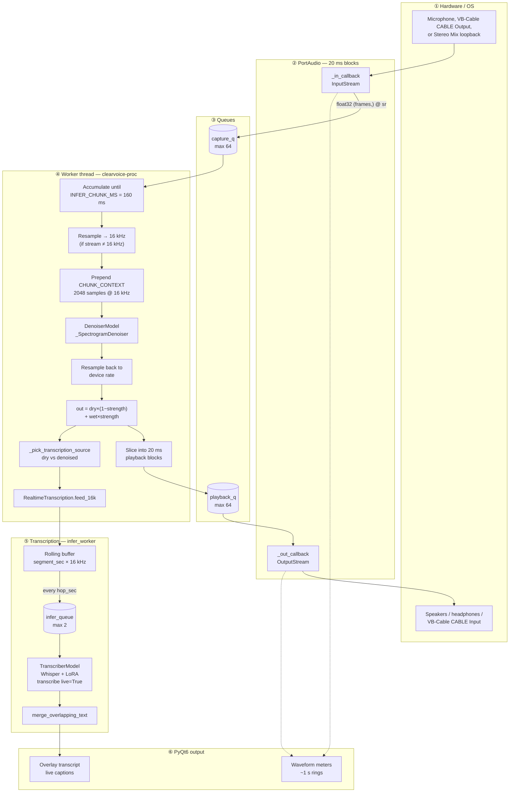
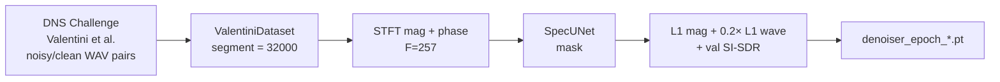

# Multilingual Speech Transcriber and Denoiser

A university project that trains two neural models for **speech denoising** and **multilingual speech-to-text**, then deploys them together in **ClearVoice** — a Windows desktop app (PyQt6) for **real-time denoised playback** and **live captions**. Training lives in Jupyter notebooks; inference and the full I/O pipeline live under [`GUI/`](GUI/).

| Artifact | Role |
|----------|------|
| [`Notebooks/Denoiser/Audio Denoising.ipynb`](Notebooks/Denoiser/Audio%20Denoising.ipynb) | Train **Spectrogram U-Net** denoiser → `denoiser_epoch_*.pt` |
| [`Notebooks/Transcriptor/Audio Transcription.ipynb`](Notebooks/Transcriptor/Audio%20Transcription.ipynb) | Fine-tune **Whisper large-v3-turbo** with **LoRA** → adapter folder |
| [`GUI/`](GUI/) | **ClearVoice** — mic/virtual-cable capture → denoise → speakers + optional live transcript |
| [`GUI/README.md`](GUI/README.md) | Install, settings, troubleshooting, and UI reference |

---

## Table of contents

1. [System overview](#system-overview)
2. [End-to-end pipeline (input → real-time output)](#end-to-end-pipeline-input--real-time-output)
3. [Tensor shapes and model I/O](#tensor-shapes-and-model-io)
4. [Training pipelines (notebooks)](#training-pipelines-notebooks)
5. [Deployment pipeline (ClearVoice GUI)](#deployment-pipeline-clearvoice-gui)
6. [Project layout](#project-layout)
7. [Quick start](#quick-start)

---

## System overview

Two models are trained offline and loaded at runtime:

| Model | Base architecture | Weights in app | Sample rate |
|-------|-------------------|----------------|-------------|
| **Denoiser** | STFT → **3-level U-Net** (`SpecUNet`) → magnitude mask → ISTFT | `GUI/weights/denoiser_epoch_15.pt` (or path in `settings.json`) | **16 kHz** mono |
| **Transcriber** | **`openai/whisper-large-v3-turbo`** + **PEFT LoRA** (`r=8`, `q_proj` / `v_proj`) | `GUI/whisper-lora-weights/` | **16 kHz** mono (Whisper mel frontend) |

ClearVoice (`GUI/main.py`) wires them through `AudioEngine` (PortAudio I/O + worker thread) and `RealtimeTranscription` (sliding-window ASR).

---

## End-to-end pipeline (input → real-time output)

The diagram below is the **full runtime path** from physical input to what you hear and read on screen. Numbered captions match the nodes.



### Captions (what happens at each stage)

| Step | Node | What happens |
|------|------|----------------|
| **①** | **Hardware input** | Audio enters from a physical mic, **VB-Audio Virtual Cable** (`CABLE Output` records what was sent to `CABLE Input`), or **Stereo Mix** loopback. Native rate is often 44.1 kHz or 48 kHz; the app prefers **16 kHz** when the device supports it. |
| **②** | **Input callback** | PortAudio delivers **~20 ms** mono `float32` blocks (`IO_BLOCK_MS = 20`). The callback only enqueues to `capture_q` and updates level meters — it must stay fast. |
| **③** | **capture_q** | Bounded queue between the real-time callback and the worker. If the worker falls behind, **oldest blocks are dropped** so denoise tracks recent speech, not seconds-old audio. |
| **④a** | **Batch 160 ms** | The worker concatenates blocks until one **inference chunk** exists: `infer_n = sr × 160 / 1000` samples (e.g. **2560** @ 16 kHz, **7056** @ 44.1 kHz before resample). |
| **④b** | **Resample → 16 kHz** | `scipy.signal.resample_poly` converts the chunk to the denoiser’s native rate. |
| **④c** | **STFT context** | The last **2048** samples (`CHUNK_CONTEXT_SAMPLES_16K`) are prepended so STFT boundaries stay continuous (overlap-add style). |
| **④d** | **Denoiser** | **`_SpectrogramDenoiser`**: STFT → U-Net mask on magnitude → ISTFT. Output length matches the padded chunk; only the **current** 160 ms tail is kept for playback. |
| **④e** | **Strength mix** | `out = original × (1 − strength) + enhanced × strength`, clipped to **[-1, 1]**. If denoise is off or weights failed, **passthrough** (`out = original`). |
| **④f** | **Playback queue** | Processed audio is split back into **20 ms** blocks for the output callback. **~400 ms preroll** (silence until `playback_q` is filled) avoids initial underruns. **Raised-cosine crossfade** between blocks reduces clicks. |
| **②** | **Output callback** | Dequeues blocks and drives **speakers** or **virtual cable** so other apps can use cleaned audio as a mic. |
| **④g** | **ASR tap** | If live transcription is on, a **16 kHz** copy of the stream is fed forward. Default is **dry capture**; optional **denoised** path with automatic fallback if the cleaned signal is too quiet for Whisper. |
| **⑤a** | **Sliding window** | `feed_16k` buffers audio. When length ≥ `segment_sec` (default **2 s** → **32 000** samples), one window is enqueued; the buffer advances by `hop_sec` (default **1 s** → **16 000** samples). |
| **⑤b** | **Whisper + LoRA** | `WhisperProcessor` builds log-mel **input_features**; `PeftModel.generate` decodes text (`max_new_tokens=48` live). Segments below **SILENCE_RMS** are skipped. |
| **⑤c** | **Merge** | `merge_overlapping_text` strips repeated words across overlapping windows so captions grow smoothly. |
| **⑥** | **UI** | **Overlay** shows waveforms, latency, transcript; **system tray** toggles denoise/transcription. Closing the window minimizes to tray; **Exit** stops streams and saves `settings.json`. |

**Offline paths (same models):** **Denoise file + play** and **Transcribe file** decode media → 16 kHz → optional denoise in **32 000-sample** chunks → playback or Whisper in **30 s** chunks (`live=False`, `max_new_tokens=128`). See [`GUI/README.md`](GUI/README.md).

---

## Tensor shapes and model I/O

### Shared audio conventions

| Quantity | Value | Notes |
|----------|-------|--------|
| Denoiser / ASR working rate | **16 000 Hz** | Mono `float32`, amplitude **[-1, 1]** |
| PortAudio I/O block | **20 ms** | `frames = sr × 0.02` (e.g. **320** @ 16 kHz) |
| Denoise inference chunk | **160 ms** | **2 560** samples @ 16 kHz per U-Net call |
| STFT context tail | **2 048** samples | Prepended before each denoise chunk @ 16 kHz |
| Live ASR window | `segment_sec` (default **2 s**) | **32 000** samples @ 16 kHz |
| Live ASR hop | `hop_sec` (default **1 s**) | **16 000** samples advance |
| Minimum denoise length | **1 408** samples | `MIN_SAMPLES = WIN_LENGTH + 7×HOP` (three max-pools) |

### Denoiser — `SpecUNet` / `_SpectrogramDenoiser`

Trained in [`Audio Denoising.ipynb`](Notebooks/Denoiser/Audio%20Denoising.ipynb); deployed in [`GUI/model.py`](GUI/model.py).

| Stage | Tensor shape | Description |
|-------|----------------|-------------|
| Input waveform | **`(B, L)`** | `L` = samples @ 16 kHz; `B=1` at inference |
| STFT complex | **`(B, F, T)`** | `F = N_FFT/2 + 1 = **257**`, `T ≈ ⌊(L − WIN_LENGTH) / HOP_LENGTH⌋ + 1` |
| U-Net input | **`(B, 1, 257, T)`** | Magnitude spectrogram |
| U-Net output (mask) | **`(B, 1, 257, T)`** | Sigmoid mask ∈ [0, 1] (GUI); notebook uses `softplus` during training |
| ISTFT output | **`(B, L)`** | Denoised waveform, cropped to original `L` |

**STFT hyperparameters (train + deploy):**

| Parameter | Value |
|-----------|-------|
| `N_FFT` / `WIN_LENGTH` | **512** |
| `HOP_LENGTH` | **128** |
| Window | Hann |

**Example `T` for common lengths @ 16 kHz:**

| Audio length | Samples `L` | Approx. time frames `T` |
|--------------|-------------|-------------------------|
| 160 ms infer chunk | 2 560 | ~17 |
| + 2048 context | 4 608 | ~33 |
| 2 s training segment | 32 000 | ~246 |
| 2 s live ASR segment | 32 000 | (not passed through U-Net whole; denoise uses 160 ms chunks) |

**U-Net channel pyramid (encoder → bottleneck → decoder):**

| Block | Channels (feature maps) |
|-------|---------------------------|
| enc1 | 1 → **32** |
| enc2 | 32 → **64** |
| enc3 | 64 → **128** |
| bottleneck | 128 → **256** |
| dec3 / dec2 / dec1 | skip connections + transposed conv upsampling |
| `out` | **1** channel (mask) |

**Checkpoint:** `denoiser_epoch_{n}.pt` (e.g. **`denoiser_epoch_15.pt`**) — full `state_dict` for `_SpectrogramDenoiser`.

---

### Transcriber — `openai/whisper-large-v3-turbo` + LoRA

Trained in [`Audio Transcription.ipynb`](Notebooks/Transcriptor/Audio%20Transcription.ipynb); deployed in [`GUI/transcriber_model.py`](GUI/transcriber_model.py).

| Component | Name / config |
|-----------|----------------|
| Base model | **`openai/whisper-large-v3-turbo`** (`WhisperForConditionalGeneration`) |
| Processor | **`WhisperProcessor`** (shared tokenizer + log-mel extractor) |
| LoRA | **`r=8`**, **`lora_alpha=32`**, **`lora_dropout=0.05`**, **`target_modules=["q_proj","v_proj"]`** |
| Trainable params (notebook run) | **~1.64M** / **~810.5M** total (**~0.20%**) |

| Stage | Tensor shape | Description |
|-------|----------------|-------------|
| Input waveform | **`(L,)`** or **`(B, L)`** | Mono @ **16 000 Hz** |
| `input_features` (log-mel) | **`(B, 128, T_mel)`** | **128** mel bins (large-v3 family); `T_mel` grows with audio length, **capped at 3000** (~30 s) |
| Decoder output | token ids → string | `batch_decode`; live **`max_new_tokens=48`**, offline **128** |

**Example `T_mel`:** for a **2 s** live window (**32 000** samples), the feature extractor produces on the order of **~200** mel frames (≪ 3000 cap). Longer offline chunks are padded/truncated by the processor.

**Adapter files:** `adapter_config.json`, `adapter_model.safetensors` (or `.bin`) under `GUI/whisper-lora-weights/`.

### Model Evaluation Results
Using Word Error Rate and Character Error Rate, where a lower number for both is better, we measured the efficacy of our model compared to the un-tuned Whisper model, as well as the base Whisper model to justify the use of Whisper Large V3 Turbo as the foundation of our project.

| Model                  | WER | CER |
| ---------------------- | ----------------------- | ----------------------- |
| Tuned Whisper Model    | 0.4879                  | 0.2458                  |
| Whisper Large V3 Turbo | 0.6895                  | 0.4212                  |
| Whisper Base           | 0.9113                  | 0.5667                  |

---

## Training pipelines (notebooks)

### 1. Audio denoising — [`Audio Denoising.ipynb`](Notebooks/Denoiser/Audio%20Denoising.ipynb)



| Item | Detail |
|------|--------|
| **Dataset** | [DNS / Valentini](https://www.dnschallenge.com/) — `noisy_trainset_56spk_wav` / `clean_trainset_56spk_wav`, test split for validation |
| **Sample rate** | **16 000 Hz** |
| **Segment** | **32 000** samples (**2 s**) per training crop |
| **Batch size** | **8** |
| **Optimizer** | Adam **lr = 5e-4** (epochs 11–20 resume from epoch 10) |
| **Model class** | `Denoiser` → `SpecUNet` + STFT/ISTFT |
| **Output** | Per-epoch **`denoiser_epoch_{n}.pth`** |

---

### 2. Audio transcription — [`Audio Transcription.ipynb`](Notebooks/Transcriptor/Audio%20Transcription.ipynb)


| Item | Detail |
|------|--------|
| **Dataset** | **`MohamedRashad/arabic-english-code-switching`** — train **500**, val **150**, test **150** (notebook split) |
| **Audio** | Resampled to **16 000 Hz**; corrupt clips filtered |
| **Features** | `processor.feature_extractor` → **`input_features`**; tokenizer → **`labels`** |
| **Training** | `per_device_train_batch_size=2`, `gradient_accumulation_steps=4`, `learning_rate=2e-4`, **10 epochs** |
| **Output** | Saved LoRA adapter (copied to `GUI/whisper-lora-weights/` for the app) |

A separate extended workflow lives under [`Notebooks/Transcriptor/Mohamed's Model/`](Notebooks/Transcriptor/Mohamed%27s%20Model/).

---

## Deployment pipeline (ClearVoice GUI)

Training artifacts are consumed as follows:

```text
denoiser_epoch_15.pt  ──►  DenoiserModel (GUI/model.py)
whisper-lora-weights/ ──►  TranscriberModel (GUI/transcriber_model.py)
                              ▲
                              │ downloads base weights on first use
openai/whisper-large-v3-turbo ┘
```

**Runtime thread model:**

| Thread | Responsibility |
|--------|----------------|
| PortAudio **input** callback | Enqueue capture only |
| **`clearvoice-proc`** worker | 160 ms denoise batches, feed ASR, fill `playback_q` |
| PortAudio **output** callback | Preroll, play, crossfade |
| **`infer_worker`** (transcription) | Whisper on 2 s / 1 s hop windows |
| Qt **main** | Overlay, tray, file jobs |

**Typical latencies (order of magnitude):** ~20 ms × I/O blocks + **~400 ms** playback preroll + **160 ms** denoise chunk + queue depth + Whisper time per segment (GPU/CPU dependent).

Full install steps, `settings.json` keys, CLI flags, and troubleshooting: **[`GUI/README.md`](GUI/README.md)**.

---

## Project layout

```text
Multilingual-Speech-Transcriber-and-Denoiser/
├── README.md                          ← this file
├── Notebooks/
│   ├── Denoiser/
│   │   ├── Audio Denoising.ipynb      ← U-Net denoiser training
│   │   └── Audio Denoising - Autoencoder.ipynb
│   └── Transcriptor/
│       ├── Audio Transcription.ipynb  ← Whisper + LoRA training
│       └── Mohamed's Model/           ← extended multilingual notebook + docs
├── Model Weights/
│   └── Transcriptor/                  ← adapter_config.json (reference copy)
└── GUI/                               ← ClearVoice application
    ├── main.py
    ├── model.py                       ← SpectrogramDenoiser
    ├── transcriber_model.py           ← Whisper + LoRA
    ├── audio_engine.py                ← real-time pipeline
    ├── transcription.py
    ├── overlay.py / tray.py
    ├── weights/                       ← denoiser_epoch_15.pt
    ├── whisper-lora-weights/
    └── README.md                      ← app operator manual
```

---

## Quick start

### Run ClearVoice (real-time denoise + captions)

```bash
cd GUI
python -m venv .venv
.venv\Scripts\activate
pip install -r requirements.txt
python main.py
```

Place **`denoiser_epoch_15.pt`** in `GUI/weights/` and the LoRA folder in `GUI/whisper-lora-weights/` before first run. See [`GUI/README.md`](GUI/README.md) for CUDA PyTorch, VB-Cable routing, and flags (`--weights`, `--whisper-weights`, `--language`, `--device`).

### Reproduce training

1. Open and run [`Notebooks/Denoiser/Audio Denoising.ipynb`](Notebooks/Denoiser/Audio%20Denoising.ipynb) on the DNS/Valentini dataset (Kaggle path in notebook `CFG.ROOT`).
2. Open and run [`Notebooks/Transcriptor/Audio Transcription.ipynb`](Notebooks/Transcriptor/Audio%20Transcription.ipynb) (downloads base Whisper from Hugging Face).
3. Copy checkpoints into `GUI/weights/` and `GUI/whisper-lora-weights/`.

---

## License

Add a license file here if you distribute the project.
